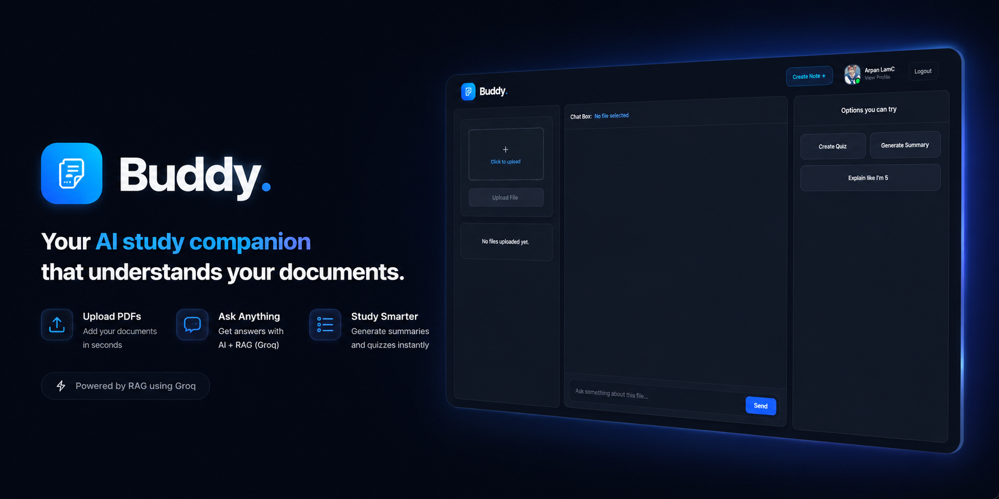

# Buddy




---

## What is Buddy?

Buddy is a full-stack web application where you can upload PDF documents and interact with them using AI. You can ask questions about your documents, generate summaries, and take auto-generated multiple-choice quizzes — all backed by RAG (Retrieval-Augmented Generation) using Groq.

---

## Features

- **PDF Upload** — Upload PDF files; text is extracted and stored for querying
- **Document Q&A** — Ask questions and get answers grounded in your document content via RAG
- **Summarization** — Generate a concise summary of any uploaded document
- **Quiz Generation** — Auto-generate multiple-choice quizzes based on document content
- **AI Chat** — Chat with the LLM in the context of your documents
- **Authentication** — JWT-based sign up / sign in with HTTP-only cookies


---

## Getting Started

### Prerequisites

- Node.js >= 18.x
- MongoDB Atlas account
- Pinecone account
- Groq API key
- Cloudinary account

### 1. Clone the repository

```bash
git clone https://github.com/OikawaToru1/Buddy.git
cd buddy
```

### 2. Setup the backend

```bash
cd server
npm install
```

`.env` variables:

```env
PORT = 3000;
CLOUDINARY_URL= 
MONGODB_URI = 
LLAMA_CLOUD_API_KEY= 
GEMINI_API_KEY = 
PINECONE_API_KEY = 
LANGCHAIN_API_KEY = 
GROQ_API_KEY = 
ACCESS_TOKEN_SECRET = 
ACCESS_TOKEN_EXPIRY = 
REFRESH_TOKEN_SECRET = 
REFRESH_TOKEN_EXPIRY = 
```

```bash
npm run dev
```

### 3. Setup the frontend

```bash
cd client
npm install

```

`.env` variables:

```env
VITE_API_URL=http://localhost:5000
```

```bash
npm run dev
```

---

## Project Structure

```
buddy/
├── client/                 # React + Vite frontend
│   ├── src/
│   │   ├── components/     # UI components
│   │   ├── pages/          # Route-level pages
│   │   └── rtk/            # redux toolkit/slices
│   └── .env                # env vairables
│   └── vercel.json         # SPA routing rewrites
│
└── server/                 # Express backend
    ├── src/
    │   ├── controllers/    # Route handlers
    │   ├── db/             # db configs
    │   ├── middleware/      # Auth & error middleware
    │   ├── models/          # Mongoose schemas
    │   ├── routes/          # Express routers
    │   └── utils/           # Chunking, embeddings, Pinecone helpers
    └── .env.example
```

---

## How It Works

1. **Upload** — PDF is streamed to Cloudinary via `multer.memoryStorage()`
2. **Parse** — `pdf-parse` extracts text from the buffer
3. **Chunk** — Text is split into sentence-boundary-aware chunks
4. **Embed & Store** — Chunks are embedded and upserted into Pinecone with `document_id` metadata
5. **Query** — User's question is embedded, matched against stored vectors, and relevant chunks are retrieved
6. **Generate** — Retrieved chunks are passed to Groq as context; the LLM returns an answer, summary, or quiz

---


## License

MIT © 2026 Buddy. Built for clarity.